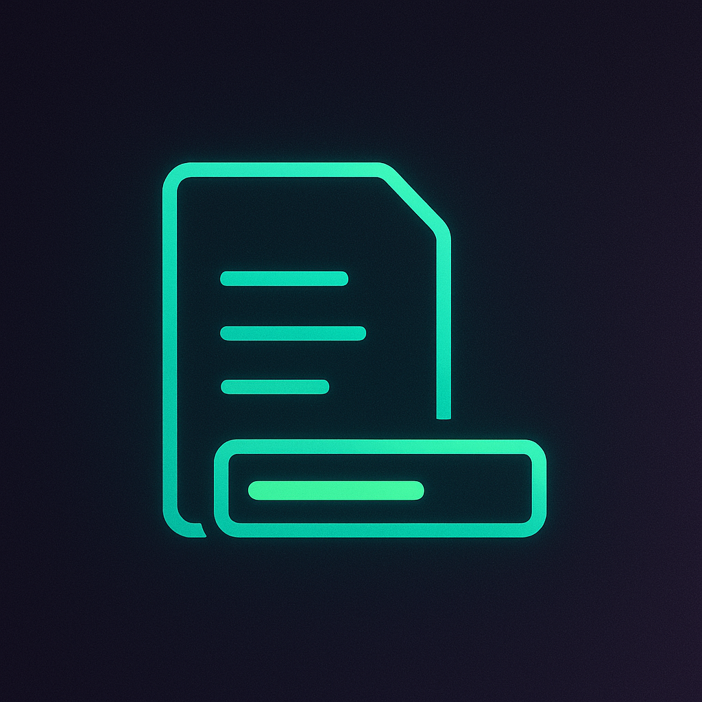

# Note Progressbar

  

An Obsidian plugin that displays a lightweight progress bar above the current note, showing how many Markdown checkboxes are complete and updating live as you toggle tasks.

## Features

- Scans the active note for standard `- [ ]` / `- [x]` tasks using Obsidian’s metadata cache.
- Renders a theme-aware bar just above the note content with totals, percentage, and a fill bar.
- Updates automatically when you check/uncheck tasks or switch notes.
- Command palette action **Toggle todo progress bar** to quickly show/hide the bar per vault.

## Usage

1. Open any note that contains Markdown checkboxes.The bar appears above the note body showing `completed of total tasks complete (xx%)`.
2. Toggle checkboxes while the note is open.The counts, percentage text, and fill bar update in under 200 ms.
3. Run the `Toggle todo progress bar` command (or set a hotkey) to hide/show the bar without disabling the plugin.
4. Notes without tasks keep the layout untouched—the bar hides automatically until tasks exist.

## Development

Refer to `DEVELOPERS.md` for setup instructions, coding guidelines, testing tips, and release steps.
