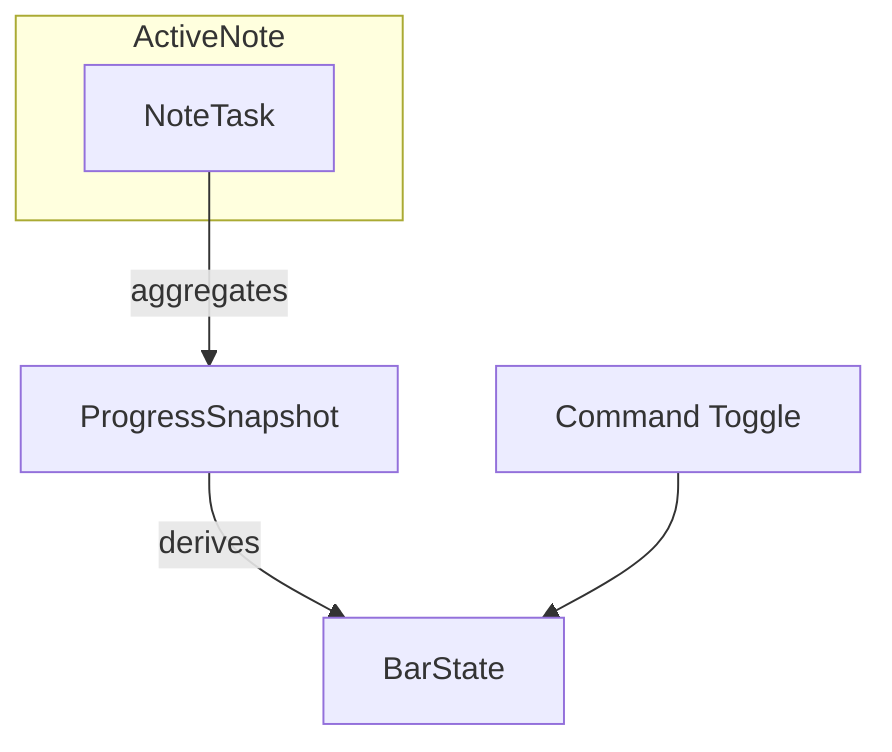

# Data Model – Todo Progress Bar MVP

## Entities

### NoteTask
- **Source**: Markdown list item with checkbox markers (`- [ ]`, `- [x]`).
- **Fields**:
  - `id`: string (constructed from file path + line number) – unique per note line.
  - `checked`: boolean – true if the checkbox is `[x]` or `[X]`.
  - `line`: number – zero-based line index for later DOM highlighting (future use).
- **Validation Rules**:
  - Only list items detected by Obsidian’s metadata cache count; checkboxes inside code blocks/quotes are ignored.
  - Nested tasks inherit the same semantics; indentation does not change counting.

### ProgressSnapshot
- **Source**: Derived aggregate for the active note.
- **Fields**:
  - `total`: number – count of `NoteTask` items found.
  - `completed`: number – count of tasks where `checked = true`.
  - `percentage`: number – `Math.round((completed / total) * 100)`; undefined when `total = 0`.
- **Validation Rules**:
  - Snapshot is only emitted when `total > 0`; otherwise the bar hides.
  - `percentage` is clamped between 0 and 100.
  - Recompute only when either totals change or active file changes to reduce DOM churn.

### BarState
- **Fields**:
  - `visible`: boolean – true when `total > 0` and command toggle not disabled.
  - `text`: string – e.g., `"60%"`.
  - `fillRatio`: number – decimals between 0 and 1 used by CSS width.
  - `celebratory`: boolean – true only when `percentage === 100`.
- **Transitions**:
  1. `hidden → visible`: triggered when first snapshot with `total > 0` arrives.
  2. `visible → celebratory`: snapshot reaches 100%.
  3. `visible/celebratory → hidden`: no tasks remain or command toggle disables the bar.

## Relationships
- `ProgressSnapshot` aggregates many `NoteTask` items from the currently focused file.
- `BarState` is derived directly from `ProgressSnapshot` plus the ephemeral toggle status.

## Derived Data & Computation Notes
- Calculations rely on Obsidian’s metadata cache for deterministic ordering; fallback to manual regex parsing only if metadata not yet ready (debounced retry).
- The note watcher emits snapshots through a callback so UI code stays framework-agnostic, aiding future unit tests.
